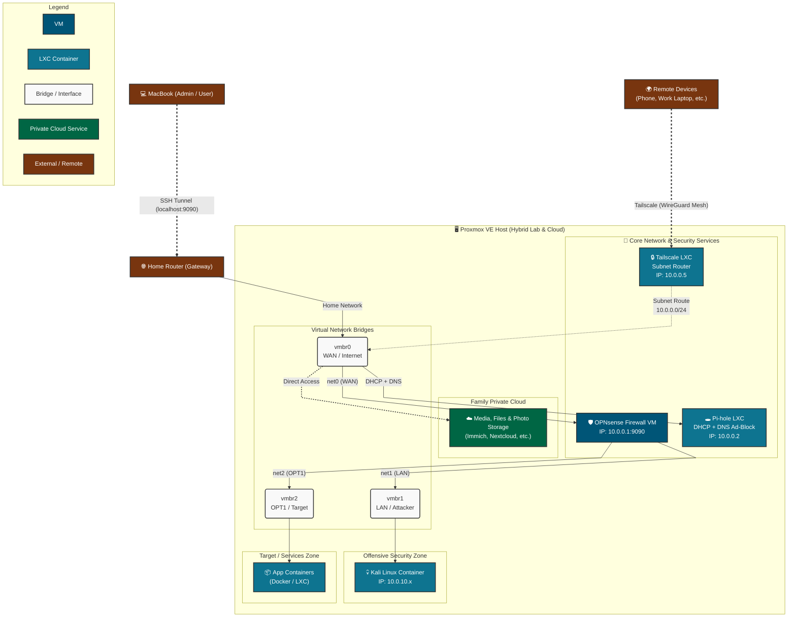

# Home Lab & Private Cloud Architecture

```mermaid
%%{init: {'flowchart': {'curve': 'linear', 'nodeSpacing': 40, 'rankSpacing': 60}}}%%
graph TD
    %% ===== Style Definitions =====
    classDef vm fill:#005577,stroke:#333,stroke-width:2px,color:#fff;
    classDef lxc fill:#0e7490,stroke:#333,stroke-width:2px,color:#fff;
    classDef physical fill:#f9f9f9,stroke:#333,stroke-width:2px,color:#333;
    classDef cloud fill:#006644,stroke:#333,stroke-width:2px,color:#fff;
    classDef external fill:#78350f,stroke:#333,stroke-width:2px,color:#fff;

    %% ===== External Devices =====
    MacBook["💻 MacBook (Admin / User)"]:::external
    Router["🌐 Home Router (Gateway)"]:::external
    RemoteDevices["🌍 Remote Devices<br/>(Phone, Work Laptop, etc.)"]:::external

    %% ===== Proxmox Infrastructure =====
    subgraph ProxmoxVE ["🖥️ Proxmox VE Host (Hybrid Lab & Cloud)"]

        subgraph CoreServices ["🧩 Core Network & Security Services"]
            OPNsense["🛡️ OPNsense Firewall VM<br/>IP: 10.0.0.1:9090"]:::vm
            Pihole["🕳️ Pi-hole LXC<br/>DHCP + DNS Ad-Block<br/>IP: 10.0.0.2"]:::lxc
            Tailscale["🔒 Tailscale LXC<br/>Subnet Router<br/>IP: 10.0.0.5"]:::lxc
        end

        subgraph AttackerZone ["Offensive Security Zone"]
            Kali["💀 Kali Linux Container<br/>IP: 10.0.10.x"]:::lxc
        end

        subgraph PrivateCloud ["Family Private Cloud"]
            Storage["☁️ Media, Files & Photo Storage<br/>(Immich, Nextcloud, etc.)"]:::cloud
        end

        subgraph TargetZone ["Target / Services Zone"]
            Containers["📦 App Containers<br/>(Docker / LXC)"]:::lxc
        end

        subgraph Bridges ["Virtual Network Bridges"]
            vmbr0("vmbr0<br/>WAN / Internet"):::physical
            vmbr1("vmbr1<br/>LAN / Attacker"):::physical
            vmbr2("vmbr2<br/>OPT1 / Target"):::physical
        end
    end

    %% ===== Connections =====
    MacBook -. "SSH Tunnel (localhost:9090)" .-> Router
    RemoteDevices -. "Tailscale (WireGuard Mesh)" .-> Tailscale

    Router -->|"Home Network"| vmbr0
    vmbr0 -->|"DHCP + DNS"| Pihole
    vmbr0 -->|"net0 (WAN)"| OPNsense
    vmbr0 -->|"Direct Access"| Storage
    Tailscale -.->|"Subnet Route<br/>10.0.0.0/24"| vmbr0

    OPNsense -->|"net1 (LAN)"| vmbr1
    vmbr1 --> Kali

    OPNsense -->|"net2 (OPT1)"| vmbr2
    vmbr2 --> Containers

    %% ===== Legend (visual only, not connected) =====
    subgraph Legend ["Legend"]
        direction LR
        L1["VM"]:::vm
        L2["LXC Container"]:::lxc
        L3["Bridge / Interface"]:::physical
        L4["Private Cloud Service"]:::cloud
        L5["External / Remote"]:::external
    end

    %% ===== Link Styling =====
    linkStyle 0 stroke-width:3px,stroke-dasharray: 5 5,stroke:d97706;
    linkStyle 1 stroke-width:3px,stroke-dasharray: 5 5,stroke:2563eb;
    linkStyle 5 stroke-width:2px,stroke-dasharray: 3 3,stroke:2563eb;
```

