# Home Lab & Private Cloud Architecture
A Proxmox-based home lab that doubles as a family private cloud and a self-contained offensive-security practice environment. A single physical host runs everything: firewall, DNS/DHCP, remote access, file storage, and an isolated attack range, segmented into separate virtual network zones so the practice environment can't reach the family-facing services.

## architecture 

## Components
 
| Component | Type | Role |
|---|---|---|
| **OPNsense** | VM | Firewall/router between zones; owns the uplink and routes traffic into the LAN and OPT1 zones |
| **Pi-hole** | LXC | DHCP + DNS for the home-network segment (`vmbr0`); blocks ads and trackers network-wide for anything on that segment |
| **Tailscale** | LXC | WireGuard-based mesh VPN; advertises the `10.0.0.0/24` subnet so authenticated remote devices can reach the lab from anywhere |
| **Kali Linux** | LXC | Isolated offensive-security container, sandboxed on its own bridge for attack simulation and tool practice |
| **App Containers** | Docker / LXC | General-purpose services running in the "target" zone |
| **Storage** | Service | Family private cloud (Immich, Nextcloud, etc.) for photos and files |

## Network Zones
 
The Proxmox host runs three virtual bridges, each mapped to an OPNsense interface:
 
- **`vmbr0` — Home LAN / uplink.** Pi-hole, Tailscale, and the private-cloud storage all sit here alongside OPNsense's uplink-facing leg. This is the segment the home router hands off to.
- **`vmbr1` — LAN / Attacker zone (OPNsense `net1`).** Hosts the Kali container, kept behind the firewall and separate from the family-facing services.
- **`vmbr2` — OPT1 / Target zone (OPNsense `net2`).** Hosts the app containers that the Kali box practices against.
